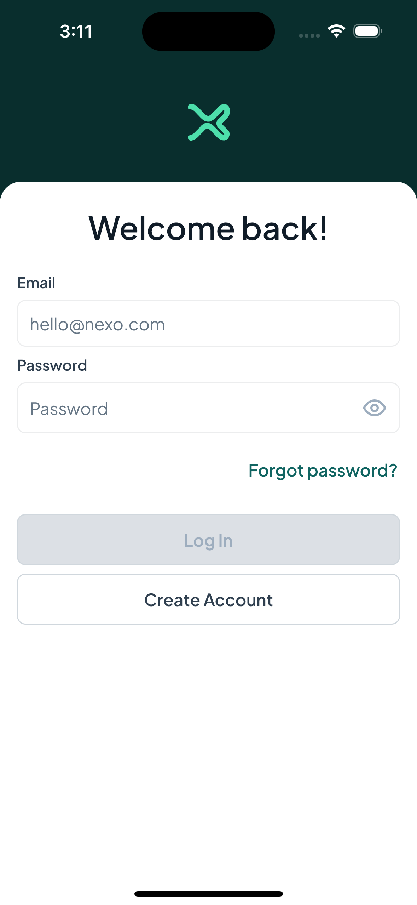
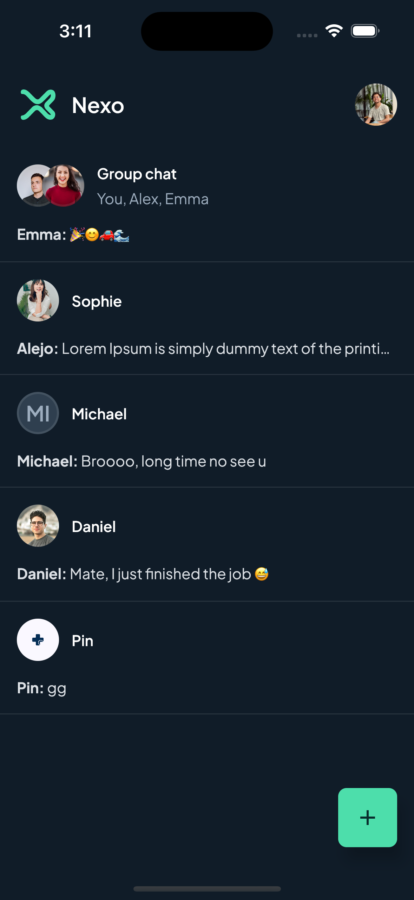
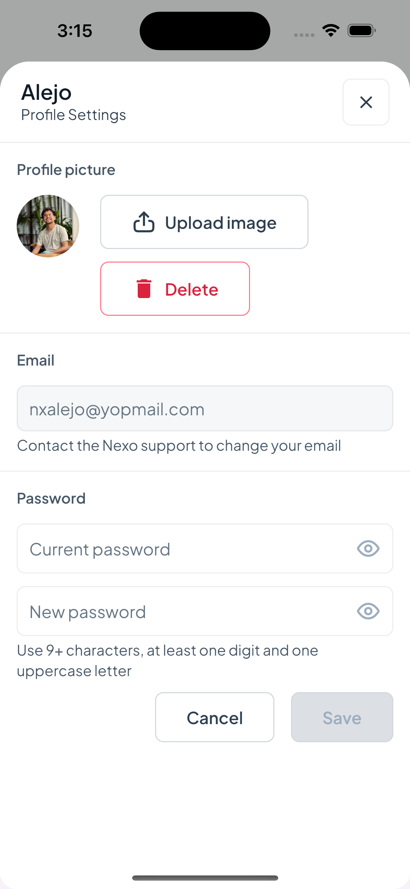
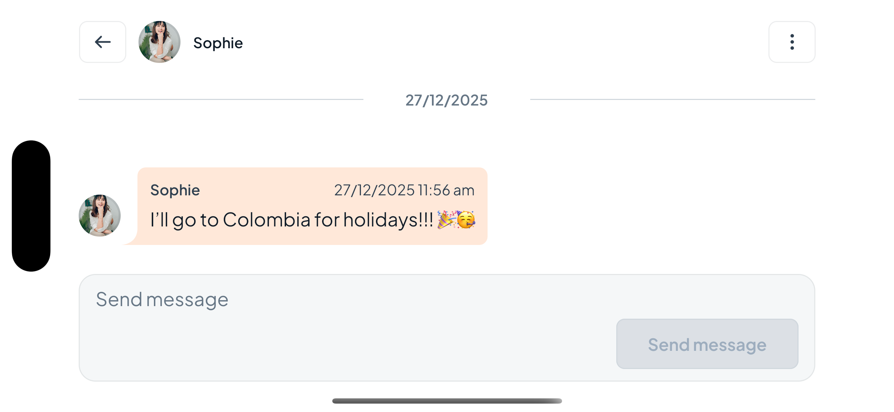

# Nexo – Compose Multiplatform Realtime Chat App

**Nexo** is a production-style chat application built with **Kotlin Multiplatform**, targeting **Android and iOS** from a shared codebase.  
The project focuses on **offline-first architecture**, **real-time communication**, and **scalable UI design**, following patterns commonly used in real-world mobile products.

This app was developed as part of the course  
**“Building Industry-Level Compose Multiplatform Android & iOS Apps”** by Philipp Lackner, and later refined to reflect industry-level practices.

## 📷 Screenshots

  
  
  
  
  

---

## 🚀 Features

- 🔐 Full authentication flow  
  - Register & login  
  - Email verification (deep links)  
  - Forgot & reset password  
  - Session persistence  

- 💬 Chat system  
  - One-to-one and group chats  
  - Create, join, and leave chats  
  - Real-time message updates  

- ⚡ Real-time communication  
  - WebSocket-based messaging  
  - Live updates for new messages, deletions, and profile changes  

- 📴 Offline-first support  
  - Local caching of chats and messages  
  - Messages and chat history available offline  
  - Local-first pagination strategy  

- 📦 Pagination  
  - Efficient message loading using local database  
  - Remote fallback when data is not cached  

- 🖼 Profile management  
  - Profile image upload & removal  
  - Real-time profile updates across devices  

- 🔔 Push notifications  
  - Background message notifications  
  - Android & iOS support  

- 🌗 Theming & UI  
  - Light and Dark themes  
  - Fully responsive layouts  
  - Optimized for mobile, tablet, and desktop  

---

## 🧱 Architecture

Nexo follows a **Clean Architecture** approach adapted for Kotlin Multiplatform:

### Key Architectural Principles

- Clear separation of concerns
- Shared business logic across platforms
- Offline-first data strategy
- Unidirectional data flow
- Reactive state handling using Flow

---

## 🛠 Tech Stack

- **Kotlin Multiplatform (KMP)**
- **Compose Multiplatform**
- **Jetpack Compose**
- **Kotlin Coroutines & Flow**
- **Ktor (HTTP & WebSockets)**
- **Local database (offline cache)**
- **Dependency Injection**
- **Push Notifications (Android & iOS)**

---

## 🧠 Key Challenges & Learnings

- Designing an **offline-first chat experience** while supporting real-time updates
- Synchronizing **WebSocket events** with locally cached paginated data
- Handling **authentication flows** with email verification and deep links
- Managing **session expiration and refresh mechanisms**
- Sharing UI and business logic across Android and iOS using Compose Multiplatform
- Ensuring UI responsiveness across different screen sizes and orientations

---

## 🧪 Possible Improvements

- Message reactions
- Read receipts
- Media messages (images, files)
- Message search
- Improved conflict resolution in offline scenarios
- End-to-end encryption

---

## 📚 Credits

- Course: **Building Industry-Level Compose Multiplatform Android & iOS Apps**
- Instructor: **Philipp Lackner (PL Coding)**

This repository represents an educational project extended and documented to reflect **real-world mobile development practices**.

---

## 📄 License

This project is intended for educational and portfolio purposes.
